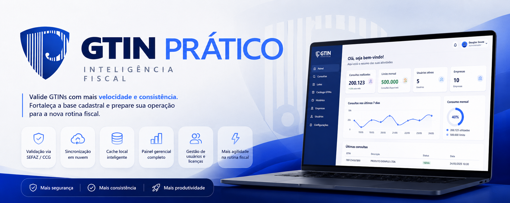
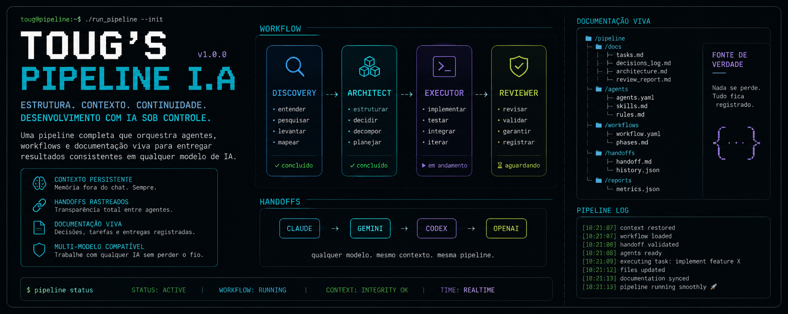
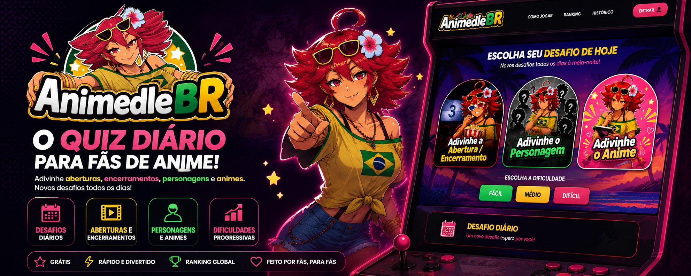

<table>
<tr>
<td>

```txt
████████╗ ██████╗ ██╗   ██╗ ██████╗
╚══██╔══╝██╔═══██╗██║   ██║██╔════╝
   ██║   ██║   ██║██║   ██║██║  ███╗
   ██║   ██║   ██║██║   ██║██║   ██║
   ██║   ╚██████╔╝╚██████╔╝╚██████╔╝
   ╚═╝    ╚═════╝  ╚═════╝  ╚═════╝
```

</td>
<td>

```bash
toug@pipeline
-------------------------
ROLE: systems builder
AI: primary development tool
FOCUS: workflows & automation
STACK: Go / React / Tauri / Docker
ARCHITECTURE: modular systems
DOCS: source of truth
STATUS: active

> understand problems
> structure systems
> coordinate workflows
> build usable things
```

</td>
</tr>
</table>

# Atualmente construindo

<p align="center">
  
</p>

## GTIN Prático

SaaS desktop-first para validação de GTIN/EAN.

O projeto combina:

- app desktop em Tauri;
- backend Go;
- painel gerencial;
- sincronização entre máquinas;
- controle de licenças;
- billing;
- cache local;
- processamento em lote.

Tudo pensado para resolver problemas reais de cadastro fiscal e validação de produtos.

🌐 https://gtin.praticasolucoes.net.br

---

<p align="center">
  
</p>

## Gerador de Relatórios de Notas

Ferramenta desktop local criada para resolver um problema operacional dentro do escritório onde trabalho.

O app:

- lê XMLs fiscais;
- processa ZIPs;
- classifica documentos;
- deduplica notas;
- gera relatórios Excel formatados.

Backend fiscal em Rust.
Frontend em React + Tauri.

Foi um projeto focado muito mais em fluxo operacional e produtividade do que em “produto”.

---

# Projetos pessoais

<p align="center">
  
</p>

## Toug's Pipeline I.A

Provavelmente o projeto que mais representa minha forma de pensar.

Criei essa pipeline porque não queria depender da memória da conversa das IAs.

Então comecei a estruturar:

```txt
agents/
workflows/
skills/
rules/
handoffs/
docs/
```

A ideia é transformar o desenvolvimento com IA em algo:

- rastreável;
- reutilizável;
- consistente;
- independente do modelo utilizado.

Hoje consigo começar um projeto em um modelo e continuar em outro sem perder contexto real do projeto.

Ela virou basicamente meu sistema operacional de desenvolvimento com IA.

🔗 https://github.com/T0ug/Toug-s_Pipeline_I.A

---

<p align="center">
  
</p>

## AnimedleBR

Projeto pessoal feito mais por diversão do que qualquer outra coisa.

Um quiz diário de anime inspirado em jogos como Wordle e Animedle.

Tem:

- openings;
- endings;
- personagens;
- modo “Adivinhe o Anime”;
- geração diária automática;
- scheduler;
- integrações com AniList, AnimeThemes e Jikan;
- backend Go;
- frontend React;
- Docker;
- PostgreSQL.

Inicialmente era só para meus amigos.
Hoje qualquer pessoa pode jogar.

🌐 https://animedlebr.com.br

---

# Coisas que gosto de construir

```txt
- sistemas desktop-first
- automações operacionais
- pipelines de IA
- ferramentas internas
- schedulers
- monólitos modulares em Go
- apps offline
- sistemas com documentação viva
- workflows rastreáveis
- projetos que sobrevivem à perda de contexto
```

---

# Filosofia

```txt
Discovery → Architect → Executor → Reviewer
```

Não gosto muito da ideia de “só gerar código”.

Prefiro:

- entender o problema;
- estruturar;
- documentar;
- rastrear decisões;
- manter continuidade entre sessões;
- construir sistemas que continuam funcionando mesmo depois que o contexto do chat acaba.

---

# Atualmente explorando

- engenharia de contexto para IA
- workflows multi-agente
- arquitetura Go
- Tauri v2
- automações operacionais
- monólitos modulares
- sistemas locais + cloud híbrido
- documentação como fonte de verdade

---

# Status atual

```txt
[ running experiments... ]
```

